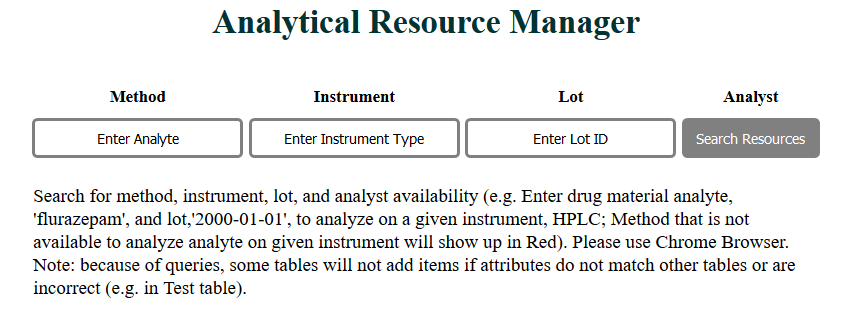
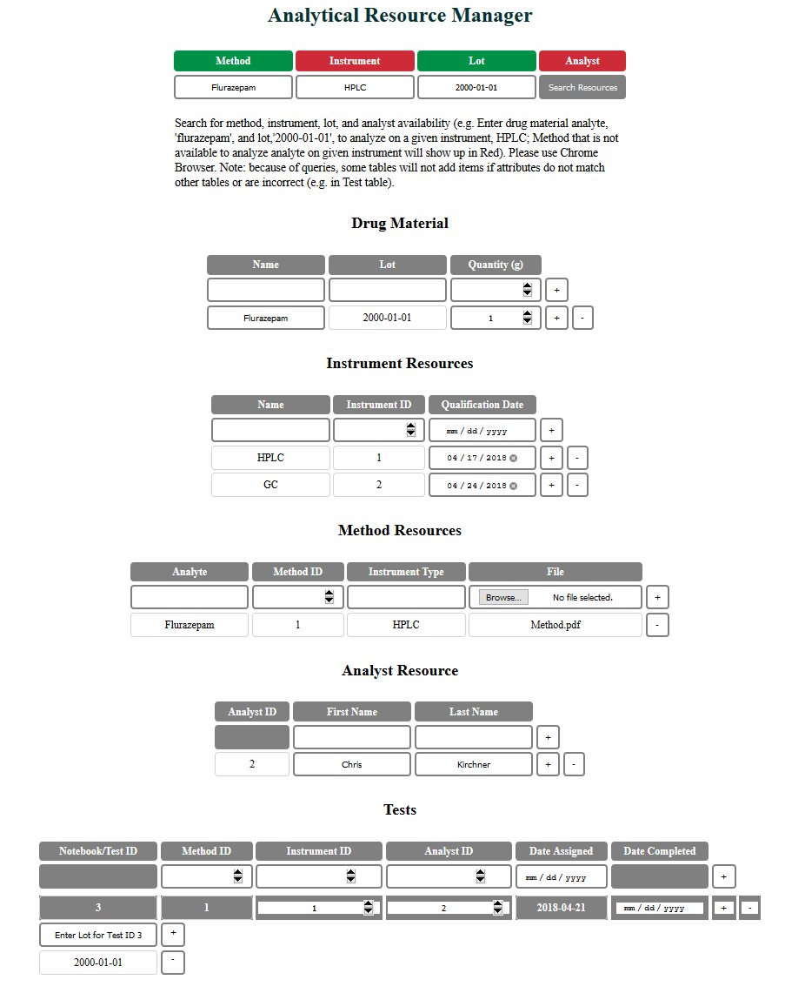
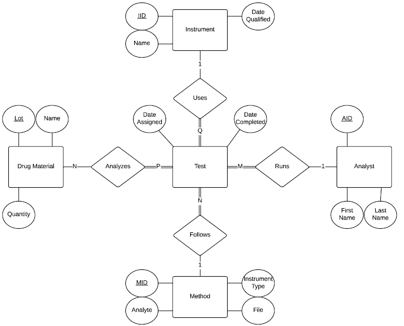
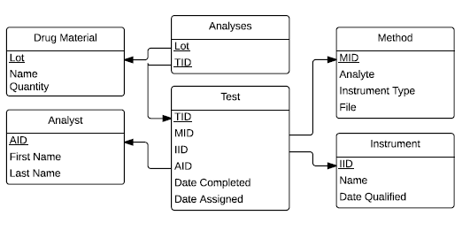

# Analytical Manager

## Overview

This project uses a database-backed web interface for a pharmaceutical 
analytical department management system.  The management system keeps 
track of drug material, instrument, method, and analyst resources within 
the department.  The system integrates these resources through tests 
that utilize specific methods, instruments, and analysts with assignment 
and completion times that are intended to analyze at least one lot of 
drug material.  The immediate availability of resources can be checked 
using a search option that accepts the main analyte, instrument, and 
lot intended for testing.  

**Note:** The purpose of this project is didactic, to fit the assigned database
requirements.  It does not reflect a realistic Analytical Management
System.

## Link to Assignment

[Analytical Manager](http://159.89.136.195:3001/analytical-manager)

## Example

## Database Design
### Entity-Relationship Diagram

This diagram displays the cardinality between entity relationships in the
Analytical Manager Database that ties all types of analytical resources to a given test.

### Database Schema

This blueprint of the database outlines its organizational structure
for tables and entries.

